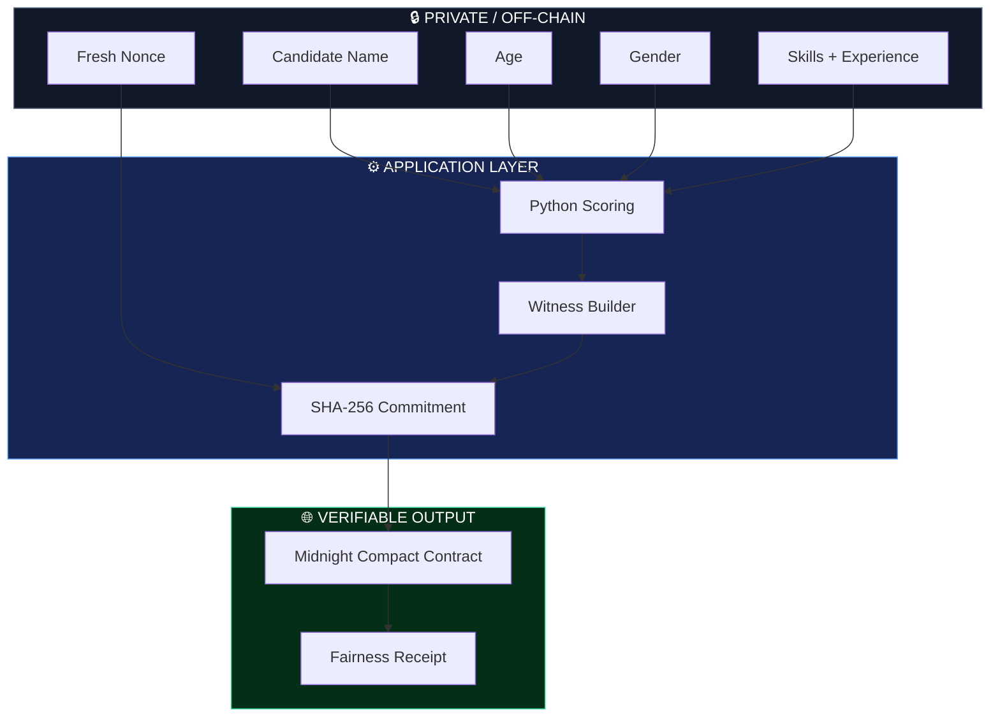
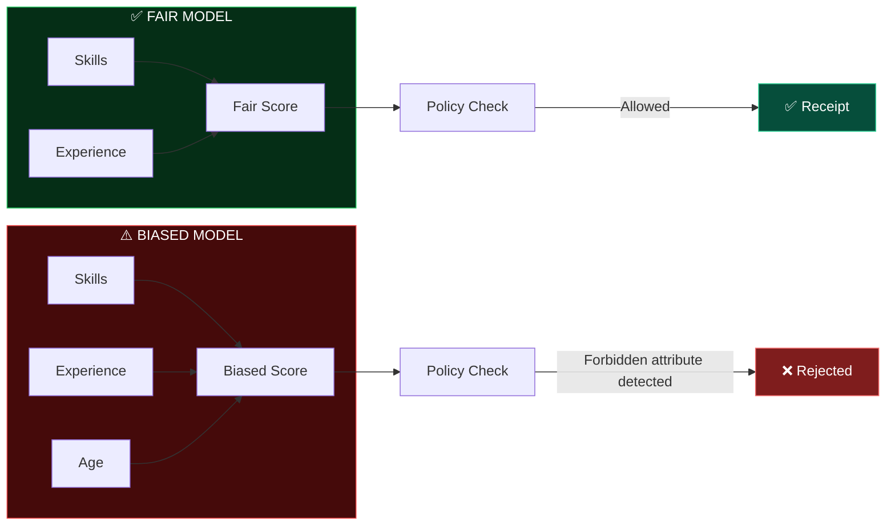

# FairGlass

### Proof-of-Fair AI Hiring on Midnight

FairGlass is a privacy-first hiring prototype that uses a **Midnight Compact smart contract** to cryptographically prove that an AI-assisted hiring decision followed an agreed fairness policy, without exposing candidate data.

<div align="center">


**Prove fairness. Preserve privacy.**

</div>

> **Midnight Hackathon · August 2026**  
> **Team:** Eman · Lastos · sumap · Donalsien · Yashasvi

> **Important:** The AI scoring model is **simulated**. It is a deterministic Python function, not a trained ML model.

---

## ✨ Why FairGlass?

AI hiring systems can use attributes that a hiring policy explicitly forbids. FairGlass separates **decision-making from proof**:

- Fair scoring uses only allowed attributes.
- A biased scoring mode demonstrates a policy violation.
- The Midnight contract verifies whether the policy was followed.
- A successful verification produces a **fairness receipt**.
- Candidate information stays off-chain.

**FairGlass proves that a policy was followed, not that a candidate was hired.**

---

## 🧭 The Fairness Pipeline

The complete decision path can be visualized as:

```mermaid
flowchart LR
    A["👤 Candidate Data"] --> B{"🤖 Scoring Model"}

    B -->|"Fair Mode"| C["⚖️ Allowed Attributes"]
    B -->|"Biased Mode"| D["⚠️ Forbidden Attribute"]

    C --> E["📜 Fairness Policy"]
    D --> E

    E --> F["🔐 Midnight Compact Contract"]

    F -->|"Policy satisfied"| G["✅ PASS"]
    F -->|"Policy violated"| H["❌ FAIL"]

    G --> I["🧾 Fairness Receipt"]
    H --> J["🚫 No Receipt"]

    I --> K["🌐 Verifiable Result"]
    
    style A fill:#111827,color:#fff,stroke:#6366f1
    style B fill:#1f2937,color:#fff,stroke:#8b5cf6
    style C fill:#064e3b,color:#fff,stroke:#10b981
    style D fill:#7f1d1d,color:#fff,stroke:#ef4444
    style E fill:#312e81,color:#fff,stroke:#818cf8
    style F fill:#172554,color:#fff,stroke:#60a5fa
    style G fill:#065f46,color:#fff,stroke:#34d399
    style H fill:#991b1b,color:#fff,stroke:#f87171
    style I fill:#064e3b,color:#fff,stroke:#34d399
    style J fill:#450a0a,color:#fff,stroke:#f87171
    style K fill:#111827,color:#fff,stroke:#a78bfa
```



> **Visual idea:** follow the flow from candidate data → scoring → policy → cryptographic proof → receipt. The two branches make the fair vs. biased behavior immediately visible.

---

## 🔐 Privacy Architecture

FairGlass follows a **proof-not-data** architecture.



### Public vs. Private

| 🌐 Public / Verifiable | 🔒 Private |
| --- | --- |
| Policy hash | Candidate name |
| Decision | Age |
| Timestamp | Gender |
| Candidate ID commitment | Skills & experience witness data |
| Fairness receipt | Commitment nonce |

---

## 🧩 Core Features

| Feature | Description |
| --- | --- |
| **⚖️ Fair AI Scoring** | Scores candidates using skills and experience |
| **🛡️ Policy Enforcement** | Rejects proofs when forbidden attributes affect a decision |
| **🔒 Privacy by Design** | Keeps candidate data and witness data off-chain |
| **🧾 Fairness Receipts** | Produces a verifiable receipt when the policy passes |
| **🔑 Commitment-Based IDs** | Uses fresh SHA-256 commitments instead of exposing candidate IDs |
| **⚠️ Biased Model Demo** | Shows how forbidden attributes are detected |
| **🔗 Local Proof Flow** | Witness data is consumed by the local proof server |

---

## 📊 Fair vs. Biased Model



Try candidates **c4** and **c5** across both runs to see how the forbidden attribute changes the outcome.

---

## 🧠 How the Proof Works

Each fairness receipt uses a fresh commitment:

```text
idCommitment = SHA256(domain || nonce || candidateId)
```

A fresh **32-byte nonce** is generated for every receipt. Repeated screenings of the same candidate therefore produce unrelated commitments.

The nonce is returned to the employer as the commitment opening. It is never written on-chain or sent to the proof server.

---

## 🎬 Demo

### 1. Start the backend

```bash
cd backend
python app.py
```

Backend: `http://localhost:5000`

### 2. Start the frontend

From the repository root:

```bash
python3 -m http.server 8080 --directory frontend
```

Frontend: `http://localhost:8080`

> **Do not open `frontend/index.html` directly with `file://`.** The frontend must be served over HTTP so browser requests to the backend work correctly.

### 3. Run both models

**Fair Model**
- Uses skills and years of experience.
- The policy passes.
- A fairness receipt is issued.

**Biased Model**
- Intentionally uses age.
- Age is forbidden by the policy.
- The proof fails and no fairness receipt is issued.

### Privacy page

With the app running, open:

```text
http://localhost:8080/privacy.html
```

Run the screening twice and compare commitments to inspect the hiding/binding behavior.

---

## 📜 Policy

### Allowed attributes
- Skills
- Years of experience

### Forbidden attributes
- Name
- Age
- Gender

All candidate data in `data/` is synthetic.

---

## 🏗️ Project Structure

```text
fairglass/
├── frontend/     # HTML/CSS/JS dashboard + receipt pages
├── backend/      # Flask service + proof bridge
├── scoring/      # Fair and biased scoring functions
├── contract/     # Midnight Compact policy contract
├── data/         # Synthetic candidate data
└── docs/         # Demo runbook and documentation
```

---

## 🛠️ Tech Stack

| Technology | Purpose |
| --- | --- |
| **Midnight Compact** | Policy verification |
| **Python** | Scoring and backend services |
| **Flask** | Backend API |
| **HTML / CSS / JavaScript** | Frontend |
| **SHA-256** | Candidate ID commitments |
| **Synthetic JSON** | Demo data |

---

## 🚀 Setup

Clone the repository:

```bash
git clone https://github.com/Eman2123/fairglass.git
cd fairglass
```

Create the backend environment:

```bash
cd backend
python3 -m venv venv
source venv/bin/activate
pip install -r requirements.txt
cd ..
```

For Windows-specific instructions, see `backend/BACKEND_SETUP.md` if present.

For the Midnight contract, follow:

```text
contract/README.md
```

---

## 🧪 Testing

Run the backend tests:

```bash
cd backend
python test_backend.py
```

---

## ⚠️ Honest Limitations

- The scoring model is a deterministic Python simulation, not a trained ML model.
- The commitment uses SHA-256 and is intended to provide computational hiding and binding.
- It is **not** a Pedersen commitment and provides no homomorphic properties.
- All demo candidate data is synthetic.

---

## 👥 Team

| Member | Role | Area |
| --- | --- | --- |
| **Eman** | Tech Lead + Frontend | `frontend/` |
| **Lastos** | Compact Engineer | `contract/` |
| **Donalsien (KADHACK)** | Integrator / Backend | `backend/`, `scoring/`, `contract/bridge/` |
| **sumap** | Frontend + Data | `frontend/`, `data/` |
| **Yashasvi** | Docs, Video + Submission | `docs/` |

---

## 📚 Documentation

- [Demo Runbook](docs/DEMO_RUNBOOK.md)
- [Backend Setup](backend/BACKEND_SETUP.md)
- [Compact Contract](contract/README.md)
- [Scoring Notes](scoring/README.md)

---

## 🤖 AI Disclosure

The team used AI coding assistants, including Claude Code, during the hackathon. Architecture, product decisions, and integration decisions were made by the team.

---

## 📄 License

This project was created as a hackathon prototype.
